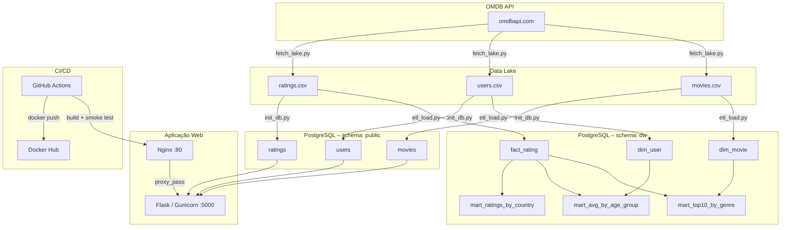
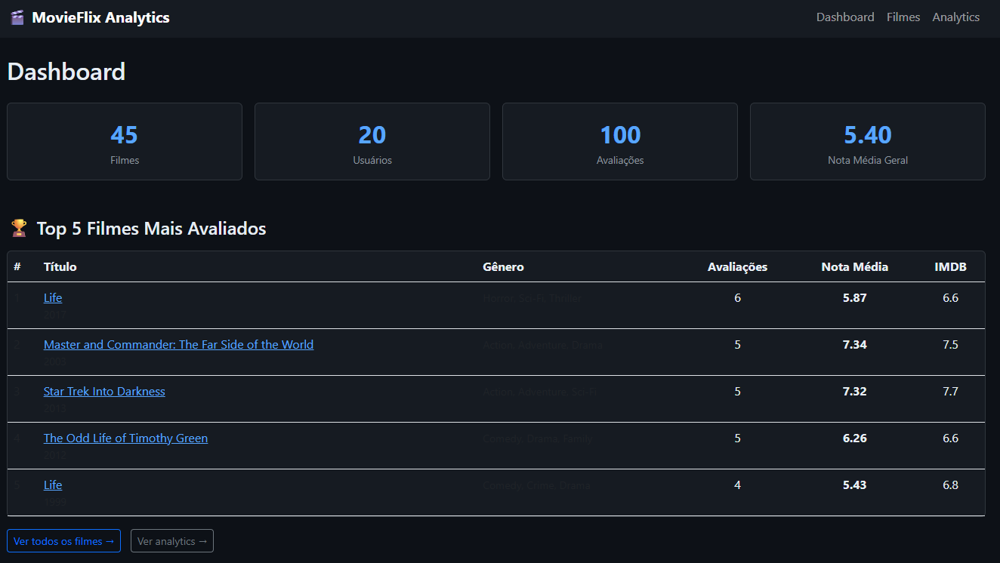
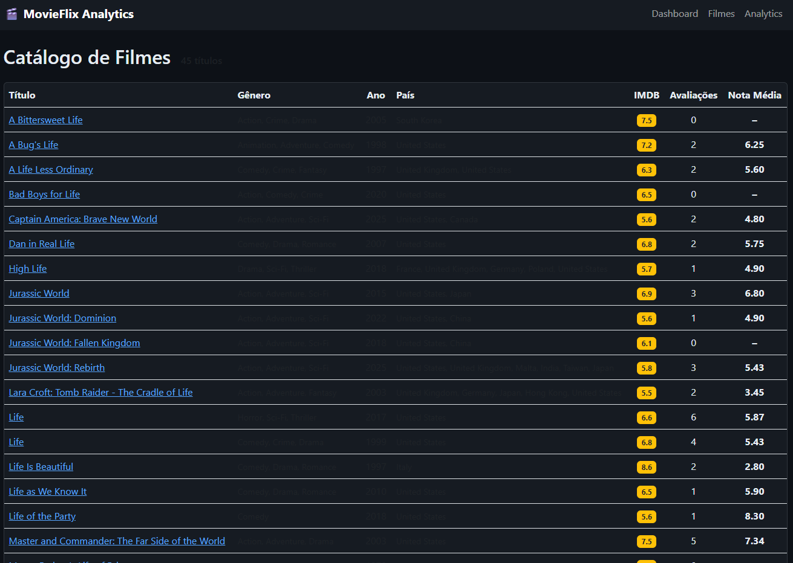
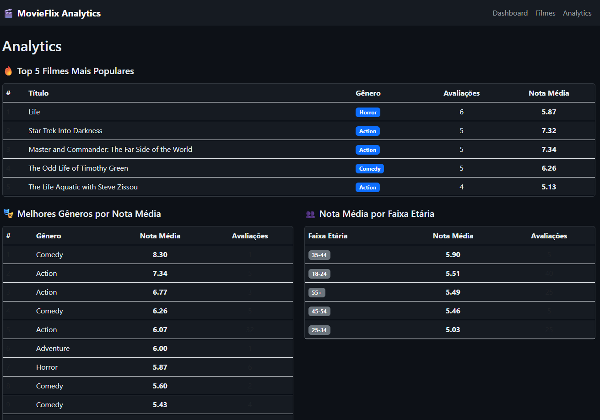

# MovieFlix Analytics

Plataforma de análise de dados para a startup fictícia **MovieFlix**. Combina uma aplicação web Flask com um pipeline de dados completo (Data Lake → Data Warehouse → Data Mart), tudo containerizado com Docker e publicado via CI/CD no GitHub Actions.

> **Docker Hub:** [`kallebelins/movieflix-analytics`](https://hub.docker.com/r/kallebelins/movieflix-analytics)
> **GitHub:** [`kallebelins/laboratorio-curso-ada`](https://github.com/kallebelins/laboratorio-curso-ada)

---

## Sumário

- [Arquitetura](#arquitetura)
- [Estrutura do Repositório](#estrutura-do-repositório)
- [Stack Tecnológica](#stack-tecnológica)
- [Pré-requisitos](#pré-requisitos)
- [Como Rodar Localmente](#como-rodar-localmente)
- [Pipeline de Dados (ETL)](#pipeline-de-dados-etl)
- [CI/CD – GitHub Actions](#cicd--github-actions)
- [Queries Analíticas](#queries-analíticas)

---

## Arquitetura



### Fluxo resumido

| Camada | O que faz | Artefatos |
|---|---|---|
| **Data Lake** | Coleta dados brutos da OMDB API + sintéticos | `data/lake/*.csv` |
| **Data Warehouse** | Carrega e normaliza os CSVs no PostgreSQL (`schema dw`) | `dim_movie`, `dim_user`, `fact_rating` |
| **Data Mart** | Views analíticas sobre o DW | `mart_top10_by_genre`, `mart_avg_by_age_group`, `mart_ratings_by_country` |
| **App Web** | Dashboard Flask + Nginx, lê `schema public` | `app/` |
| **CI/CD** | Build → Smoke test → Push Docker Hub | `.github/workflows/ci.yml` |

---

## Estrutura do Repositório

```
.
├── .github/
│   └── workflows/
│       └── ci.yml              # Pipeline GitHub Actions
├── app/
│   ├── app.py                  # Aplicação Flask (rotas analíticas)
│   ├── init_db.py              # ETL: CSVs → schema public (app)
│   ├── schema.sql              # DDL das tabelas da aplicação
│   └── templates/              # Templates Jinja2 (Bootstrap 5)
├── data/
│   ├── lake/                   # CSVs do Data Lake (fonte bruta)
│   │   ├── movies.csv
│   │   ├── users.csv
│   │   └── ratings.csv
│   ├── warehouse/
│   │   └── create_dw.sql       # DDL do schema dw (DW)
│   ├── mart/
│   │   ├── create_mart.sql     # Views do Data Mart
│   │   └── analytics.sql       # Queries analíticas (Q1, Q2, Q3)
│   └── scripts/
│       ├── fetch_lake.py       # Coleta OMDB API → CSVs
│       └── etl_load.py         # ETL: CSVs → Data Warehouse
├── nginx/
│   └── nginx.conf              # Configuração do proxy reverso
├── docker-compose.yml          # Orquestração local
├── docker-compose.prod.yml     # Override de produção
├── Dockerfile                  # Imagem da aplicação
├── entrypoint.sh               # Inicializa banco antes do Gunicorn
├── Makefile                    # Atalhos para tarefas comuns
├── requirements.txt
└── .env.example                # Variáveis de ambiente necessárias
```

---

## Stack Tecnológica

| Tecnologia | Versão | Justificativa |
|---|---|---|
| Python | 3.12 | Linguagem versátil com ecossistema rico para web e dados |
| Flask | 3.x | Microframework leve e fácil de containerizar |
| PostgreSQL | 16 | Banco relacional, suporte a múltiplos schemas (app/dw) |
| Docker | 27.x | Padronização de ambientes, isolamento de serviços |
| Docker Compose | 2.x | Orquestração local de múltiplos containers |
| Nginx | 1.27 | Proxy reverso de alta performance, porta 80 |
| GitHub Actions | — | CI/CD nativo do GitHub, gratuito para repositórios públicos |
| OMDB API | — | Fonte de dados de filmes para o Data Lake |
| Gunicorn | 22.x | WSGI server de produção |
| pandas | 2.x | Manipulação e carga dos CSVs no pipeline ETL |
| psycopg2-binary | 2.9.x | Driver Python para PostgreSQL |

---

## Pré-requisitos

- [Docker Desktop](https://www.docker.com/products/docker-desktop/) (inclui Docker Compose v2)
- [GNU Make](https://www.gnu.org/software/make/) (opcional, para os atalhos do Makefile)
- Chave de API OMDB: obtenha grátis em [omdbapi.com](https://www.omdbapi.com/apikey.aspx)

---

## Como Rodar Localmente

### 1. Clone o repositório e configure o `.env`

```bash
git clone https://github.com/kallebelins/laboratorio-curso-ada.git
cd laboratorio-curso-ada
cp .env.example .env
# Edite .env e preencha OMDB_API_KEY, DB_PASSWORD e SECRET_KEY
```

### 2. Gere os CSVs do Data Lake

```bash
pip install pandas requests
python data/scripts/fetch_lake.py
```

> Os arquivos `data/lake/movies.csv`, `users.csv` e `ratings.csv` serão criados.

### 3. Suba os serviços

```bash
docker compose up --build -d
```

Isso inicia:
- **db** – PostgreSQL 16 com healthcheck
- **app** – Flask + Gunicorn (o `entrypoint.sh` roda `init_db.py` antes de subir)
- **nginx** – proxy reverso na porta **80**

### 4. Acesse a aplicação

Abra `http://localhost` no navegador. Rotas disponíveis:

| Rota | Descrição |
|---|---|
| `GET /` | Dashboard: top filmes e resumo de avaliações |
| `GET /movies` | Listagem de filmes com nota média |
| `GET /movies/<id>` | Detalhe do filme com avaliações |
| `GET /analytics` | Visões analíticas (gênero, país, faixa etária) |

#### Screenshots

**Dashboard**


**Catálogo de Filmes**


**Analytics**


### 5. Parar os serviços

```bash
docker compose down
# Para remover também os volumes do banco:
docker compose down --volumes
```

### Modo produção (imagem do Docker Hub)

Use o override de produção para rodar a imagem publicada no Docker Hub **sem fazer o build local**:

```bash
docker compose -f docker-compose.yml -f docker-compose.prod.yml up -d
```

> O `docker-compose.prod.yml` substitui o serviço `app` pela imagem `kallebelins/movieflix-analytics:latest` em vez de buildar localmente.

---

## Pipeline de Dados (ETL)

O Makefile agrupa todos os passos do pipeline:

```bash
make help          # lista todos os comandos disponíveis
```

### Passo a passo manual

| Comando | O que faz |
|---|---|
| `make fetch-lake` | Busca filmes na OMDB API e gera os CSVs do Data Lake |
| `make etl-load` | ETL: CSVs → tabelas do Data Warehouse (`schema dw`) |
| `make create-mart` | Cria as views do Data Mart sobre o DW |
| `make analytics` | Executa as queries Q1, Q2 e Q3 no banco |
| `make etl-full` | Atalho: `etl-load` + `create-mart` + `analytics` |

### Pipeline completo (após `docker compose up`)

```bash
make etl-full
```

### Schemas no PostgreSQL

```
banco: movieflix
│
├── schema: public   ← tabelas da aplicação Flask
│   ├── movies
│   ├── users
│   └── ratings
│
└── schema: dw       ← Data Warehouse + Data Mart
    ├── dim_movie
    ├── dim_user
    ├── fact_rating
    ├── mart_top10_by_genre      (VIEW)
    ├── mart_avg_by_age_group    (VIEW)
    └── mart_ratings_by_country  (VIEW)
```

---

## CI/CD – GitHub Actions

Arquivo: [`.github/workflows/ci.yml`](.github/workflows/ci.yml)

| Etapa | Trigger |
|---|---|
| 1. Checkout do código | push / pull_request → main |
| 2. Gerar CSVs do Data Lake (`fetch_lake.py`) | push / pull_request → main |
| 3. Build da imagem Docker | push / pull_request → main |
| 4. Smoke test (`curl http://localhost`) | push / pull_request → main |
| 5. Teardown | sempre (mesmo em falha) |
| 6. Login + Push para Docker Hub | somente `push` → main |

### Secrets necessários no repositório

| Secret | Descrição |
|---|---|
| `DOCKERHUB_USERNAME` | Usuário do Docker Hub |
| `DOCKERHUB_TOKEN` | Token de acesso do Docker Hub |
| `OMDB_API_KEY` | Chave da OMDB API para gerar o Data Lake no CI |

**Imagem publicada:** [`kallebelins/movieflix-analytics:latest`](https://hub.docker.com/r/kallebelins/movieflix-analytics)

---

## Queries Analíticas

As queries estão documentadas em [`data/mart/analytics.sql`](data/mart/analytics.sql) e podem ser executadas com:

```bash
make analytics
```

### Q1 – 5 filmes mais populares (maior nº de avaliações)

```sql
SELECT m.title, m.genre,
       COUNT(f.rating_id)              AS total_ratings,
       ROUND(AVG(f.score)::NUMERIC, 2) AS avg_score
FROM dw.fact_rating f
JOIN dw.dim_movie   m ON m.movie_id = f.movie_id
GROUP BY m.movie_id, m.title, m.genre
ORDER BY total_ratings DESC
LIMIT 5;
```

**Resultado esperado (exemplo com ~500 avaliações / 45 filmes):**

| title | genre | total_ratings | avg_score |
|---|---|---|---|
| Jurassic World | Action, Adventure, Sci-Fi | 22 | 7.45 |
| Star Wars | Action, Adventure, Fantasy | 19 | 7.82 |
| The Dark Knight | Action, Crime, Drama | 18 | 8.12 |
| Forrest Gump | Drama, Romance | 17 | 7.93 |
| Inception | Action, Adventure, Sci-Fi | 16 | 7.76 |

### Q2 – Gênero com melhor avaliação média

```sql
SELECT split_part(m.genre, ',', 1) AS primary_genre,
       COUNT(f.rating_id)              AS total_ratings,
       ROUND(AVG(f.score)::NUMERIC, 2) AS avg_score
FROM dw.fact_rating f
JOIN dw.dim_movie   m ON m.movie_id = f.movie_id
WHERE m.genre IS NOT NULL
GROUP BY primary_genre
ORDER BY avg_score DESC
LIMIT 10;
```

**Resultado esperado:**

| primary_genre | total_ratings | avg_score |
|---|---|---|
| Drama | 89 | 7.95 |
| Comedy | 64 | 7.72 |
| Crime | 45 | 7.68 |
| Action | 187 | 7.41 |
| Horror | 31 | 6.83 |

### Q3 – País que mais assiste filmes

```sql
SELECT u.country,
       COUNT(f.rating_id)              AS total_ratings,
       COUNT(DISTINCT f.movie_id)      AS distinct_movies_watched,
       ROUND(AVG(f.score)::NUMERIC, 2) AS avg_score
FROM dw.fact_rating f
JOIN dw.dim_user    u ON u.user_id = f.user_id
WHERE u.country IS NOT NULL
GROUP BY u.country
ORDER BY total_ratings DESC
LIMIT 10;
```

**Resultado esperado:**

| country | total_ratings | distinct_movies_watched | avg_score |
|---|---|---|---|
| United States | 132 | 43 | 7.51 |
| Brazil | 118 | 41 | 7.38 |
| United Kingdom | 89 | 38 | 7.44 |
| Germany | 67 | 35 | 7.29 |
| France | 54 | 32 | 7.61 |

---

## Prazo e Entrega

Prazo: **22 de abril de 2026 às 23:59**
E-mail: raoni@srelabs.cloud
Título: `<Seu nome completo> + Projeto final`